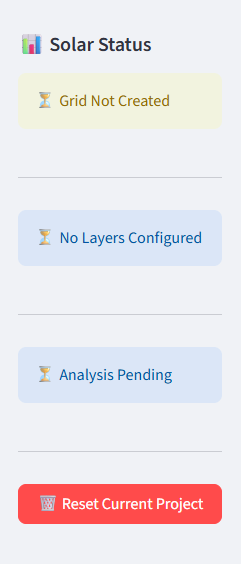
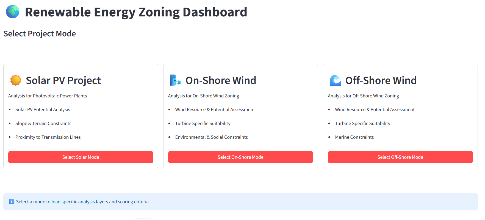
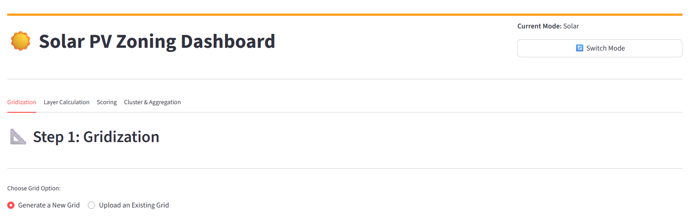
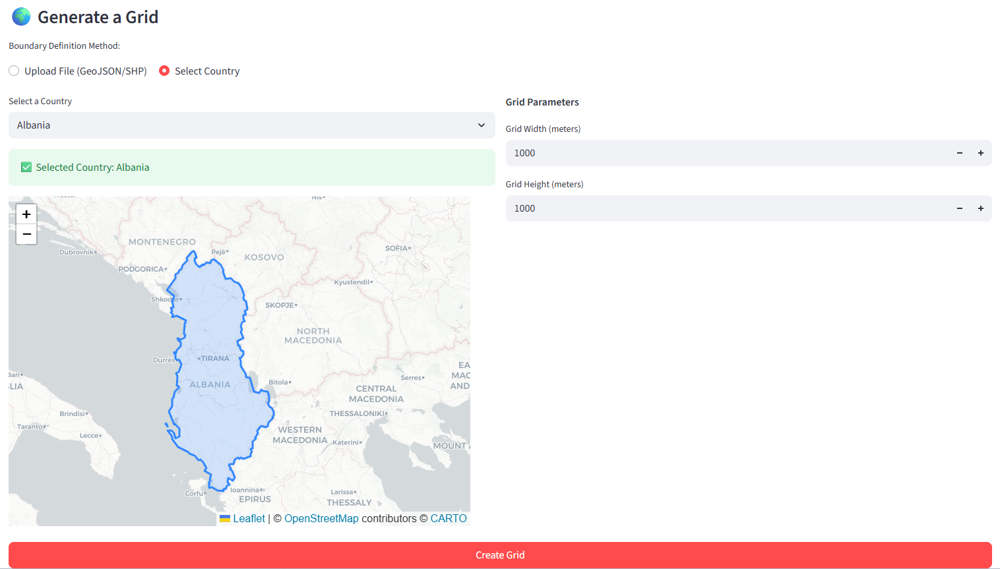
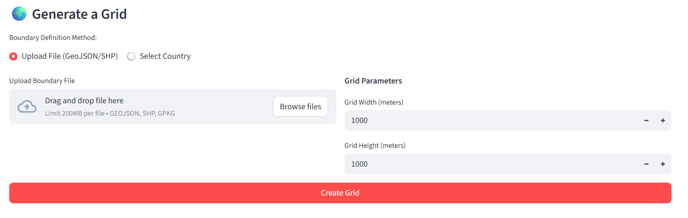
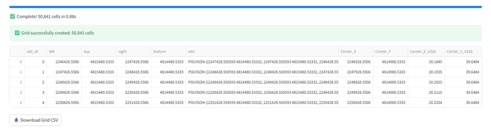
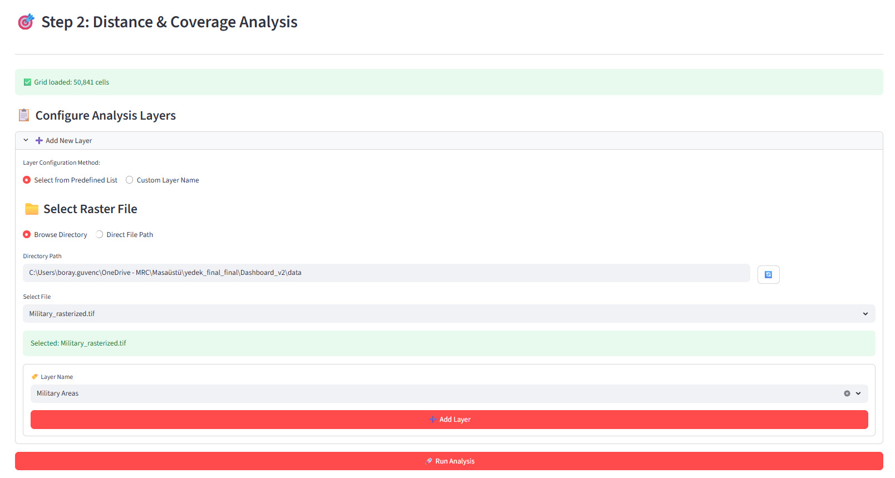
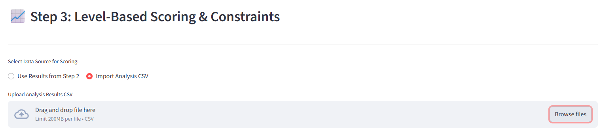

# Renewable Energy Zoning Dashboard (Dashboard_v2)

This repository contains the **Zoning Tool**, a Streamlit-based application used for analyzing, scoring, and zoning viable geographical regions for Renewable Energy projects. It robustly supports **Solar PV**, **On-Shore Wind**, and **Off-Shore Wind** project types.

---

## 📖 Part 1: User Guide & Tutorial

This section explains how to use the dashboard from start to finish. Launch the application (e.g., using `streamlit run main.py`) and follow the steps. The sidebar persistently tracks your project status across all tabs:



### 1. Project Mode Selection
Upon launching the dashboard, you are prompted to select your project mode:



- **Solar PV**
- **On-Shore Wind**
- **Off-Shore Wind**

Selecting a mode loads specific configurations, analysis layers, and predefined scoring templates tailored to that energy type.

### 2. Tab 1: Gridization (Base Grid Creation)

You are going to start with the "Gridization Tab", where you can choose to generate a grid or upload an existing one. The existing grid should be in the format that has been created by the app and downloaded as a csv file. If you are going to upload an existing grid, you can skip the "Create a New Grid" part, and move to the next tab directly.



- **Select Boundary**: Choose the geographical constraint boundary (e.g., NUTS regional data for On-Shore, EEZ boundaries for Off-Shore).
  - *By Country Selection:*
    
  - *By Custom Shapefile Upload (e.g. if you have your own shapefile of the region you want to analyze):*
    
- **Define Grid Size**: Set the dimensions of the grid cells (e.g., `1000m x 1000m` or depending on the turbine diameter).
- **Generate Grid**: The application calculates and generates an interactive map of the defined grid overlaid onto your selected region. User should wait until the grid is generated and loading bar is completed. User can download the grid as a csv file and save it for future use if they need. User should not close the tab or the application while the grid is being generated.
  


### 3. Tab 2: Layer Calculation

This layer is for calculating the values of the grid cells based on the spatial data. User should upload the spatial data and the application will calculate the values of the grid cells based on the spatial data. User should wait until the layer calculation is completed and loading bar is completed. User can download the layer as a csv file and save it for future use if they need. This way, user can directly skip to the third tab.User should not close the tab or the application while the layer calculation is being performed.



- **Configure Layers**: Depending on your mode, predefined geospatial constraints will appear (e.g., Slope, Proximity to Grid, Wind Speed). Those are the reference layers that are essential to be used for a comprehensive zoning analysis. If the user wants to use different layers, user can upload his/her own layers and configure his/her own settings. For each predefined layers, user can adjust specific parameters. It is strongly suggested to include those reference layers for a comprehensive zoning analysis.
- **Upload Rasters/Shapefiles**: Point the application to the respective raster configurations (`.tif`) that dictate geographic features. The app expects binary rasters where objects are represented as `1` and the background as `0` for proper calculation. If a layer's mode includes distance, the app will calculate the distance of each grid cell to the nearest object in the raster. Therefore, binary rasters are expected as input for distance calculations (not for other modes).
- **Calculate Overlap**: The engine will overlay your grid cells atop the spatial data and calculate cell-by-cell statistical values (like average wind speed or max slope percentage).
- **Output**: The output of this tab is a csv file that contains the grid cells and their values based on the spatial data. The app directly transfers the calculated values to the next tab.

### 4. Tab 3: Level & Scoring Setup

In this tab, user can set the levels and scores for each layer. User can also set the knock-out and weighted scoring rules.



- **Knock-Out (HARD Constraints)**: Define rules where cells are eliminated (Score = 0). For example, if a cell overlaps with a military zone or if the slope > 30%, it is immediately knocked-out.
- **Weighted Scoring (SOFT Constraints)**: Assign customized weights to the remaining layers to calculate a final prioritization score for every viable grid cell.
- **Execute**: Run the scoring. The map will visually reflect high-potential zones and zero-score zones.

### 5. Tab 4: Cluster Analysis & Aggregation
- **Group Viable Areas**: Grid cells alone aren't practical for mega-projects. This step joins adjacent viable cells into contiguous "Plants" or "Clusters".
- **Capacity Limits**: Define the Nominal MW capacity per cell and the Maximum Allowable MW per cluster. The engine automatically partitions oversized zones using a graph-based balancing logic ensuring no zone exceeds your limit.
- **Export Results**: Download the consolidated project clusters as `.csv`, `.shp`, or `.geojson` for further PMO and engineering usage.

---

## 🛠 Part 2: Developer Architecture

This section is dedicated to modifying, understanding, and extending the Dashboard's codebase.

### Project Structure Overview

```text
Dashboard_v2/
├── main.py                 # Core Streamlit application entry point
├── config.py               # Global directory strings and system defaults
├── utils/                  # Configuration Manager and Profiles
│   ├── config_manager.py   # Factory to inject context based on project type
│   ├── config_solar.py     # Solar constraints and defaults
│   ├── config_onshore.py   # On-Shore constraints and defaults
│   └── config_offshore.py  # Off-Shore constraints and defaults
├── engines/                # Heavy-Lifting Spatial Backend
│   ├── grid_engine.py      # Vector grid generation logic
│   ├── raster_scorer.py    # Raster mapping, overlapping and scoring calculations
│   └── cluster_engine.py   # NetworkX Graph-based adjacent grid clustering
├── ui/                     # Isolated Streamlit UI Views
│   ├── tab_gridization.py
│   ├── tab_scoring.py
│   ├── tab_level_scoring.py
│   └── tab_cluster_analysis.py
└── data/                   # Default storage location for I/O
```

### Core Architectural Principles

1. **Configuration-Driven Architecture (Factory Pattern)**:
   The application avoids hardcoded conditionals mapping Solar against Wind logic. Instead, `main.py` invokes `ConfigManager.get_active_config()` which retrieves a class (`SolarConfig`, `OffShoreConfig`, etc.). The UI and Engines dynamically reference the metrics (`app_config.DEFAULT_LAYERS`, `app_config.THEME_COLOR`) defined in these isolated config structs.

2. **Clean Separation of Concerns (UI vs Engine)**:
   Streamlit files inside `ui/` (`tab_gridization.py`, etc.) are entirely devoid of intensive GeoPandas algorithms. Their single responsibility is state-binding and chart rendering.
   When users click "Run", the UI passes state variables to the dedicated Engine classes in `engines/` which execute the vectorized math and return standardized DataFrames back to the UI.

3. **Performance & Vectorized Engines**:
   - **`raster_scorer.py`**: Executes chunked parallel processing of heavy `.tif` files mapped onto `.shp` boundaries.
   - **`cluster_engine.py`**: Leverages `NetworkX` graph adjacency calculations (`nx.connected_components`) and vectorized `GeoPandas` structural dissolves to spatially merge plant clusters faster than traditional looped geometric unions. Graph balancing recursively splits nodes until `max_capacity_mw` constraints are met. 

### Adding a New Project Type
To add a new theoretical energy type (e.g., "Hydro Power"):
1. Duplicate `utils/config_solar.py` to `utils/config_hydro.py` and adjust constants (layers, knockout rules).
2. Wire it in `utils/config_manager.py`.
3. Add a new clickable card to the `render_landing_page()` inside `main.py`. The engines and tabs will dynamically adopt the framework.
